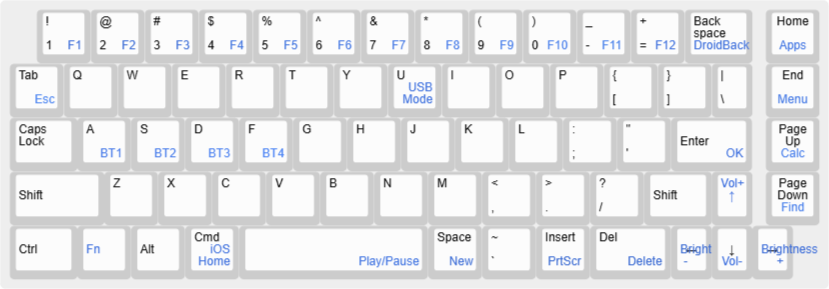

# Palm Portable Keyboard Bluetooth Adapter Manual

hardware rev. 3.1 2024-09-15

How to use:
  * Plug the adapter into the Palm Portable Keyboard, it automatically powers on. Search it on your 
    phone or PC's Bluetooth settings, it shows up as "PDA Keyboard 1". Pair it and it will work.
  * The adapter supports pairing up to 4 Bluetooth hosts simultaneously, and supports wired USB
    connection, too.
      * Press Fn+A, S, D or F to switch between Bluetooth hosts 1~4, the Bluetooth name is
        "PDA Keyboard 1/2/3/4", respectively.
      * Long press Fn+A, S, D or F for 1 second to force that "channel" into pairing mode
        again.
      * Press Fn+U to switch to USB mode (it does not automatically switch to USB mode
        when USB cable is plugged in, the user has to manually switch it)
  * To factory reset the adapter, use a pin or a paper clip to press and hold the small button on the
    adapter for 3 seconds. Do this if you have pairing issues. You also need to "forget" the keyboard
    in the host's settings before pairing again.
  * The adapter enters sleep mode after idling for 25 minutes. Press any key to wake it up.

LED Functionality:
  * Blue + Green + Red LED constant on: The adapter is handshaking with the keyboard.
      * If it is stuck at this state for more than 3 seconds, it means the adapter is not
        communicating correctly with the keyboard. Please consider the following possibilities:
          * The adapter is not seated properly, please re-attach the adapter, and check if the
            contacts are connected properly.
          * The keyboard may be broken and not responding to the handshake.
          * The adapter may be low on battery, try to charge it for a few minutes.
  * Yellow LED: charging indicator
      * On: charging.
      * Off: charge complete.
  * Blue LED: Bluetooth indicator
      * Blue and Red alternately blink: Bluetooth pairing mode.
      * Fast blink: reconnecting to the last paired host.
      * Slow blink 1/2/3/4 times: Paired to the host 1/2/3/4, normal usage. The blink will stop
        after 1 minute to avoid distraction.
      * Off: USB mode, or the keyboard is in sleep, or it has been more than 1 minute since the
        last Bluetooth host switch.
  * Green LED: Caps Lock indicator
      * On: Caps Lock on.
      * Off: Caps Lock off.
  * Red LED: battery indicator
      * blink once: battery is below 20%.
      * blink twice: battery is below 15%.
      * blink three times: battery is below 10%.

Special Key mapping:

  * Fn+A/S/D/F= Bluetooth host switch
  * Long press Fn+A/S/D/F= pairing mode
  * Fn+U=USB mode

  * Fn+Tab=Esc

  * Fn+1=F1, Fn+2=F2,...,Fn+'='=F12

  * Fn+Cmd=iOS Home
  * Fn+Backspace=Android Back
  * Fn+Space=Play/Pause
  * Fn+<=Previous Song
  * Fn+>=Next Song

  * Done=Insert
  * Fn+Done=PrtScr

  * Fn+Up/Down=Volume Up/Down
  * Fn+Right/Left=Brightness Up/Down

  * Home
  * End
  * Pg Up
  * Pg Down

Notes and Warnings:

This device contains a Lithium-Polymer battery.
  * Please do not crush, disassemble or puncture the device; or short the exposed metal pins. There
    is a risk of fire by doing so.
  * Please recharge as soon as the Yellow LED starts blinking, to maintain the longevity of the 
    battery.
  * If this device is not used for a long time, please charge it at least every 3 months.
